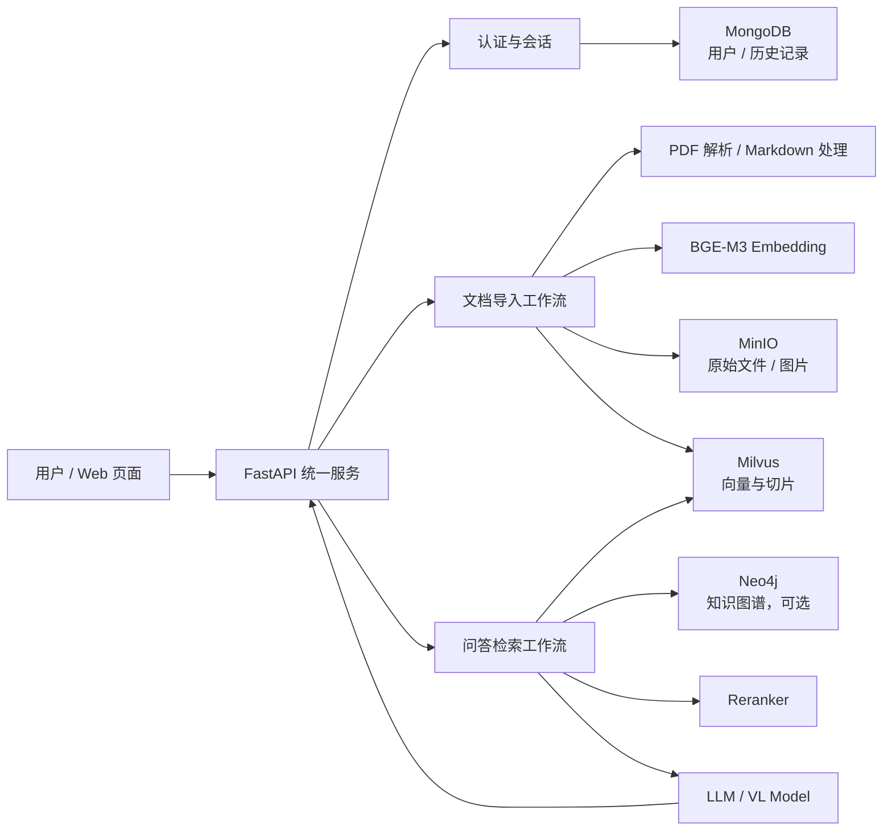
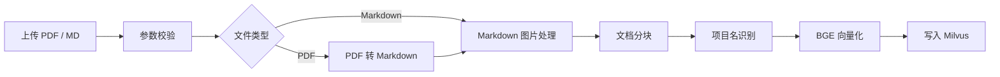
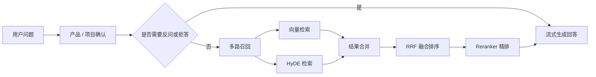

<div align="center">

# FusionRAG

面向企业知识库的多路融合 RAG 系统，覆盖文档导入、向量检索、知识图谱查询、重排序、流式问答与 Web 管理页面。

[](https://www.python.org/)
[](https://fastapi.tiangolo.com/)
[](https://www.langchain.com/langgraph)
[](https://milvus.io/)
[](https://www.mongodb.com/)
[](https://min.io/)

</div>

---

## 目录

- [项目亮点](#项目亮点)
- [系统架构](#系统架构)
- [核心流程](#核心流程)
- [功能模块](#功能模块)
- [项目结构](#项目结构)
- [环境要求](#环境要求)
- [快速启动](#快速启动)
- [环境变量](#环境变量)
- [接口概览](#接口概览)
- [数据与存储](#数据与存储)
- [开发提示](#开发提示)

## 项目亮点

FusionRAG 将文档解析、知识库入库、混合检索和对话式问答整合到一个统一的 FastAPI 服务中，适合做企业内部技术资料、产品手册、交付文档和运维知识的检索增强问答。

| 能力 | 说明 |
| --- | --- |
| 文档导入 | 支持 PDF / Markdown 上传，后台任务异步解析并写入知识库。 |
| 结构化解析 | PDF 可转换为 Markdown，图片可提取并生成摘要，便于多模态资料入库。 |
| 混合检索 | 基于 BGE-M3 生成 Dense / Sparse 表征，结合 HyDE、多路召回与 RRF 融合。 |
| 精排生成 | 召回结果经过 Reranker 重排后再交给大模型生成回答。 |
| 会话管理 | MongoDB 保存用户、权限和聊天历史，支持多会话查询。 |
| 统一 Web | 内置简洁前端页面，提供登录、文档管理和流式问答入口。 |
| 可观测任务 | 导入与问答过程通过 SSE 推送进度、增量回答、最终结果和错误事件。 |

## 系统架构



## 核心流程

### 文档入库



### 问答检索



## 功能模块

| 模块 | 路径 | 作用 |
| --- | --- | --- |
| 统一服务 | `app/unified_service.py` | Web 页面、认证、文档、会话和问答接口入口。 |
| 导入流程 | `app/import_process/` | PDF / Markdown 解析、图片处理、分块、识别、向量化和入库。 |
| 查询流程 | `app/query_process/` | 商品 / 项目确认、多路检索、RRF、重排和回答生成。 |
| 模型工具 | `app/lm/` | LLM、Embedding、Reranker 的统一封装。 |
| 存储客户端 | `app/clients/` | MongoDB、Milvus、MinIO、Neo4j 连接工具。 |
| 配置中心 | `app/conf/` | 通过 `.env` 注入模型、数据库、对象存储等配置。 |
| 前端页面 | `app/web/` | 登录、知识库管理和聊天页面资源。 |
| 提示词 | `prompts/` | 查询改写、图片摘要、答案生成等 Prompt 模板。 |
| 本地依赖 | `docker/knowledgebase/` | MongoDB、Milvus、MinIO、Attu 的 Compose 配置。 |
| 示例文档 | `doc/` | 用于本地验证的 PDF 技术文档。 |

## 项目结构

```text
FusionRAG/
├─ app/
│  ├─ clients/              # MongoDB、Milvus、MinIO、Neo4j 工具
│  ├─ conf/                 # 环境变量配置映射
│  ├─ core/                 # 日志与 Prompt 加载
│  ├─ import_process/       # 文档导入 LangGraph 工作流
│  ├─ lm/                   # LLM / Embedding / Reranker 封装
│  ├─ query_process/        # 检索问答 LangGraph 工作流
│  ├─ tool/                 # 本地模型下载辅助脚本
│  ├─ utils/                # SSE、限流、路径、格式化等工具
│  ├─ web/                  # 静态 Web 页面
│  └─ unified_service.py    # FastAPI 应用入口
├─ docker/knowledgebase/    # 本地依赖服务编排
├─ doc/                     # 示例知识库文档
├─ prompts/                 # Prompt 模板
├─ pyproject.toml           # Python 依赖声明
└─ README.md
```

## 环境要求

| 依赖 | 建议版本 | 用途 |
| --- | --- | --- |
| Python | 3.11+ | 运行 FastAPI、LangGraph 和模型工具。 |
| uv | 最新稳定版 | 安装与同步 Python 依赖。 |
| Docker / Docker Compose | 最新稳定版 | 启动 MongoDB、Milvus、MinIO 等本地依赖。 |
| BGE-M3 | 本地或可访问路径 | 文本 Dense / Sparse 向量化。 |
| BGE Reranker | 本地或可访问路径 | 检索结果精排。 |
| LLM / VL Model | OpenAI 兼容接口 | 文本问答、图片摘要和结构化识别。 |

## 快速启动

### 1. 启动本地依赖

```bash
cd docker/knowledgebase
docker compose up -d
```

本地服务默认端口：

| 服务 | 地址 | 说明 |
| --- | --- | --- |
| MongoDB | `mongodb://127.0.0.1:27018` | 用户、权限、会话历史。 |
| Milvus | `http://127.0.0.1:19531` | 文档切片与向量数据。 |
| Attu | `http://127.0.0.1:18000` | Milvus 可视化管理页面。 |
| MinIO API | `127.0.0.1:19010` | 原始文件与图片对象存储。 |
| MinIO Console | `http://127.0.0.1:19011` | MinIO 管理页面。 |

### 2. 安装 Python 依赖

```bash
uv sync
```

### 3. 配置环境变量

在项目根目录创建 `.env`，参考 [环境变量](#环境变量) 章节补齐模型、数据库和对象存储配置。

### 4. 启动服务

```bash
uv run python app/unified_service.py
```

默认访问：

```text
http://127.0.0.1:8000
```

如需修改监听地址：

```bash
HOST=0.0.0.0 PORT=8000 uv run python app/unified_service.py
```

PowerShell 示例：

```powershell
$env:HOST="0.0.0.0"; $env:PORT="8000"; uv run python app/unified_service.py
```

## 环境变量

下面是常用配置模板。请不要将真实密钥提交到 Git。

```dotenv
# Service
HOST=127.0.0.1
PORT=8000
PROJECT_ROOT=

# Auth
AUTH_SECRET_KEY=replace-with-a-long-random-secret
AUTH_TOKEN_EXPIRE_SECONDS=86400
ADMIN_INVITE_CODE=admin
PASSWORD_PBKDF2_ROUNDS=310000

# MongoDB
MONGO_URL=mongodb://127.0.0.1:27018
MONGO_DB_NAME=fusionrag

# Milvus
MILVUS_URL=http://127.0.0.1:19531
CHUNKS_COLLECTION=chunks_collection
ENTITY_NAME_COLLECTION=entity_name_collection
ITEM_NAME_COLLECTION=item_name_collection

# MinIO
MINIO_ENDPOINT=127.0.0.1:19010
MINIO_ACCESS_KEY=minioadmin
MINIO_SECRET_KEY=minioadmin
MINIO_BUCKET_NAME=knowledgebase
MINIO_IMG_DIR=images
MINIO_SECURE=False
MINIO_PDF_DIR=pdf

# LLM / VL Model
OPENAI_BASE_URL=
OPENAI_API_KEY=
LLM_DEFAULT_MODEL=
LLM_DEFAULT_TEMPERATURE=0.2
VL_MODEL=

# MinerU
MINERU_BASE_URL=
MINERU_API_TOKEN=

# Embedding
BGE_M3_PATH=
BGE_M3=
BGE_DEVICE=cpu
BGE_FP16=False

# Reranker
BGE_RERANKER_LARGE=
BGE_RERANKER_DEVICE=cpu
BGE_RERANKER_FP16=False

# Web Search MCP, optional
MCP_DASHSCOPE_BASE_URL=

# Neo4j, optional
NEO4J_URI=
NEO4J_USERNAME=
NEO4J_PASSWORD=

# Logging
LOG_CONSOLE_ENABLE=True
LOG_CONSOLE_LEVEL=INFO
LOG_FILE_ENABLE=True
LOG_FILE_LEVEL=INFO
LOG_FILE_RETENTION=7 days
```

## 接口概览

| 方法 | 路径 | 说明 |
| --- | --- | --- |
| `GET` | `/` | 返回内置 Web 首页。 |
| `POST` | `/auth/register` | 注册用户，支持通过邀请码创建管理员。 |
| `POST` | `/auth/login` | 登录并返回访问令牌。 |
| `GET` | `/auth/me` | 获取当前用户信息。 |
| `POST` | `/documents/upload` | 上传 PDF / Markdown 并启动后台入库任务。 |
| `GET` | `/documents/status/{task_id}` | 查询文档入库任务状态。 |
| `GET` | `/documents` | 列出已入库文档及切片数量。 |
| `DELETE` | `/documents/{filename}` | 删除指定文档的向量数据。 |
| `GET` | `/assets/image` | 代理访问对象存储图片。 |
| `POST` | `/chat/stream` | 发起流式问答，返回 SSE。 |
| `GET` | `/sessions` | 获取当前用户会话列表。 |
| `GET` | `/sessions/{session_id}` | 获取指定会话消息。 |
| `DELETE` | `/sessions/{session_id}` | 删除指定会话历史。 |

## 数据与存储

| 数据类型 | 存储位置 | 说明 |
| --- | --- | --- |
| 原始文件 / 图片 | MinIO | 保存上传文档和解析出的图片资源。 |
| 文档切片 / 向量 | Milvus | 保存切片文本、元数据、Dense / Sparse 向量。 |
| 用户 / 会话 | MongoDB | 保存用户认证信息与聊天历史。 |
| 知识图谱 | Neo4j，可选 | 用于扩展结构化知识查询能力。 |
| 日志 / 运行输出 | `logs/`、`output/` | 本地调试与任务输出，不建议提交。 |

## 开发提示

- `.env`、`.venv`、`logs/`、`output/` 和 Docker volume 数据属于本地运行产物，不应提交到版本库。
- 导入任务是后台执行的，前端或调用方可通过 `/documents/status/{task_id}` 获取进度。
- 问答接口使用 SSE 返回增量内容，客户端需要按事件流方式读取响应。
- 若 Milvus、MongoDB 或 MinIO 连接失败，优先检查 Docker 服务状态和 `.env` 中的端口配置。
- 如果需要重建本地知识库数据，可先确认 Docker volume 中没有需要保留的内容，再清理对应 volume 目录。

---

<div align="center">

Built for practical RAG experiments, enterprise knowledge search, and retrieval workflow evaluation.

</div>

## 下一步计划

实现Neo4j知识图谱链路。
